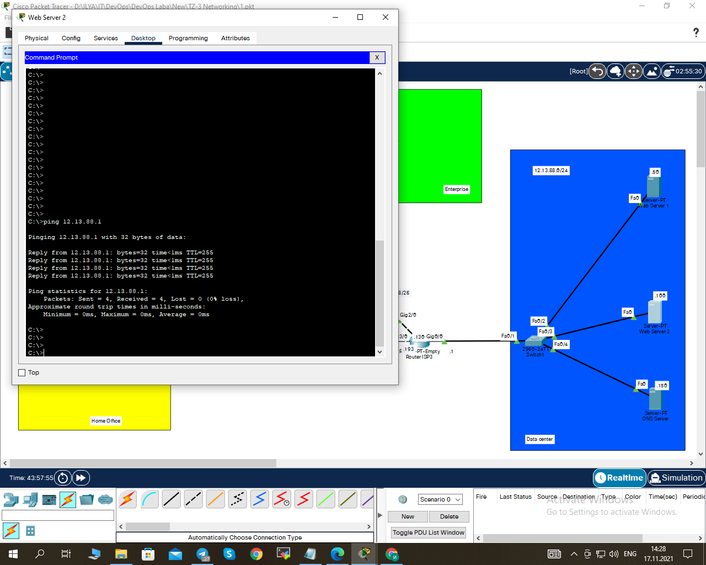
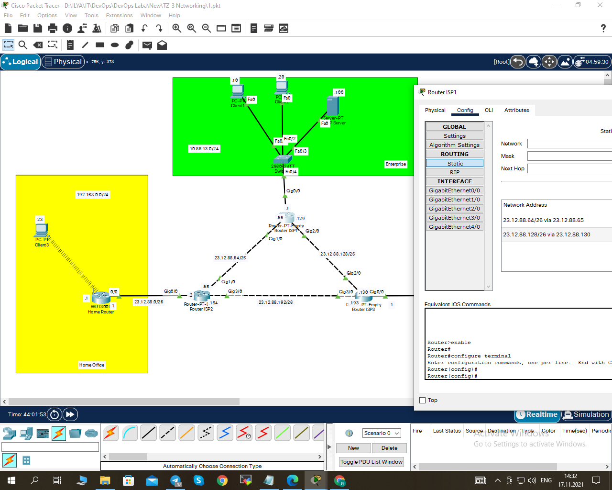

1. Networks Hone Office, Data Center, Entrprise were created. Connection was created between the PCs, 
servers, and switches in each of the networks:                
                                                              
                                                              
                                                              
                                                              
															  
                                                              
                                                              
                                                              
2. The connectoon between routers ISP 1, ISP 2, ISP 3:        
                                                              
                                                              
                                                              
                                                              
															                                                               
3. In Data Center the subnet mask has been changed to 255.255.255.192: 
                                                              
                                                              
                                                              
4. Wireshark was installed. Traffic was captured using Wireshark.
                                                              														  
5. VLANs have been configured in the Data Center. As a result, the computers in the data center stopped pinging 
because they belonged to different subnets :                  
                                                                                                                                                        
6. The Routing between VLANs has been configured:             
                                                                
7. Routing tables were configured on all routers:             
                                                              
															    
8. A RIP protocol was configured on routers ISP 1-3:          
                                                                
															  
9. The DHСP was configured:                                   
                                                              
                                                              
                                                              
                                                              
															   
															   
10. The DNS service was configured. The work of the DNS service was checked:
                                                              
															  
															  
11. The Port forwarding on the Home Office was created and the it's work was checked:
                                                              
                                                                
															  
															  

