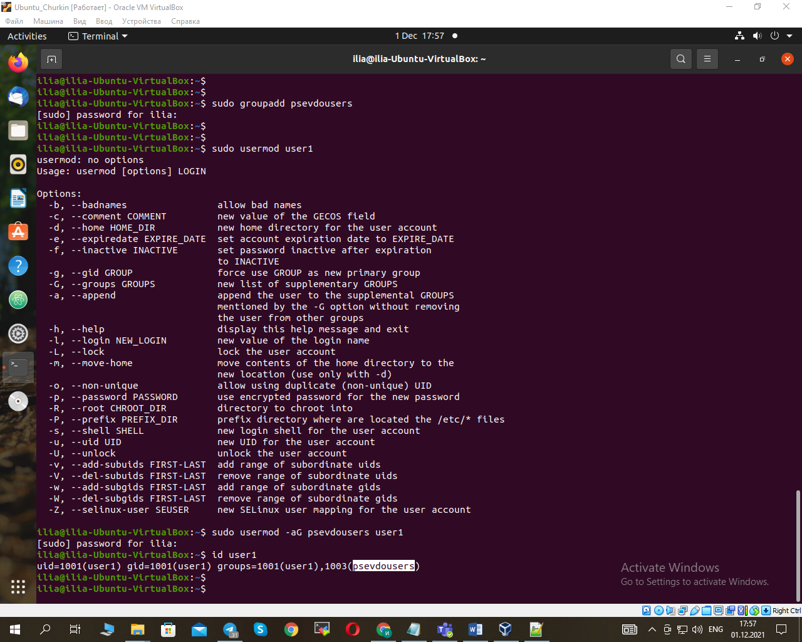
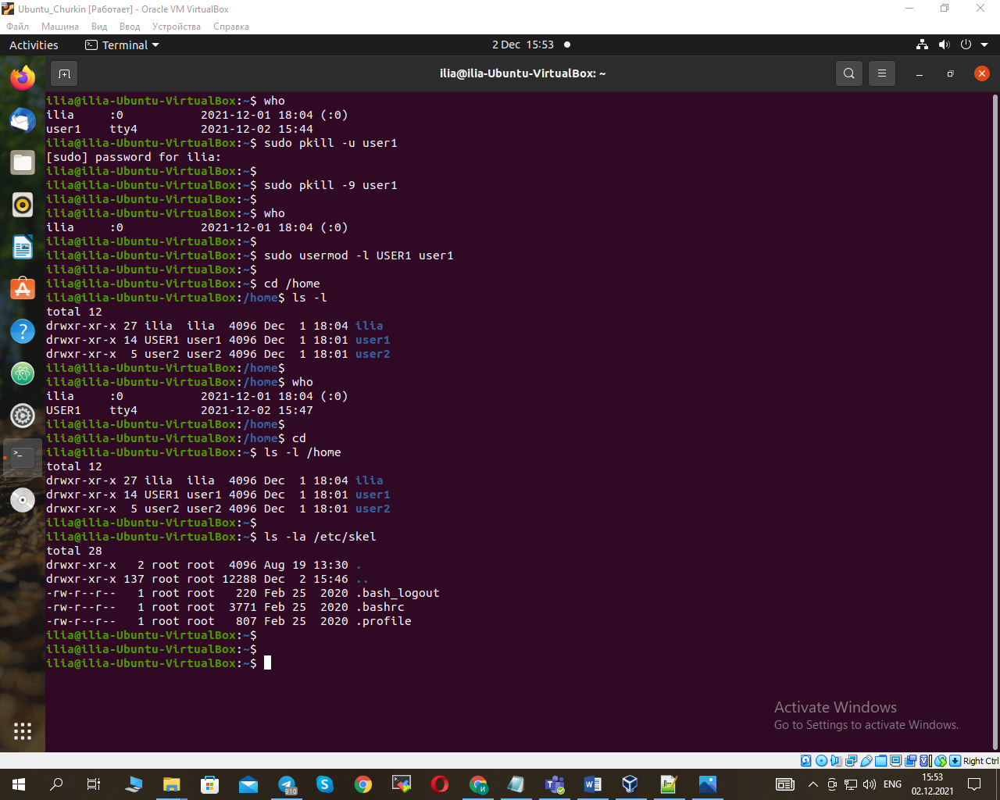
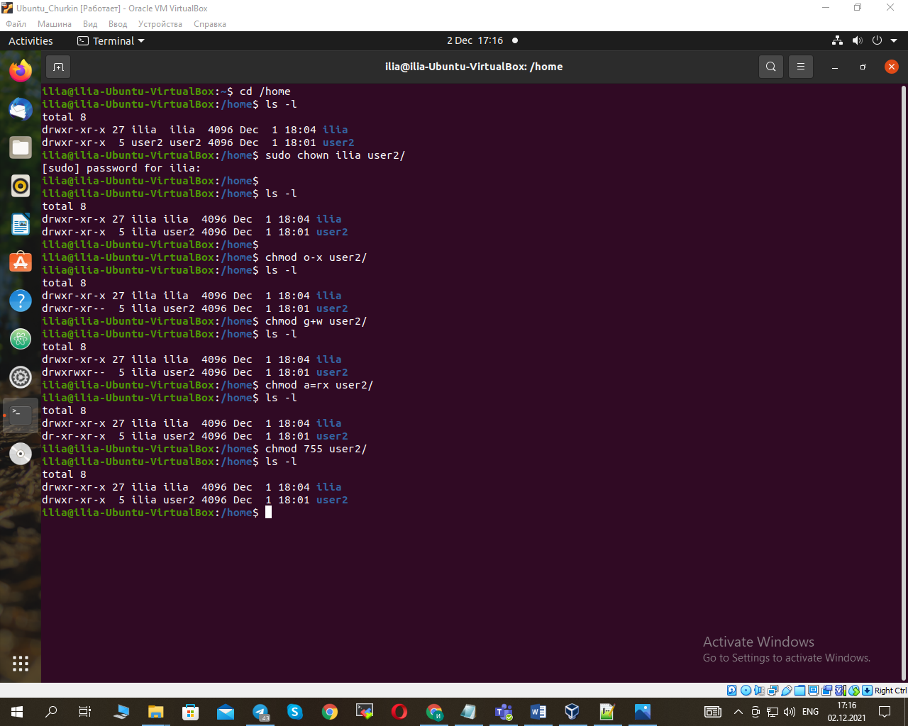

1. Added users:                                           
                                                        
                                                        
                                                                                                       
2. UID (UserID), GID (GroupID), groups. Defined by the command "id":    
                                                         
3. Used "usermod". Renamed "user1" to "USER1". Used "/skel".
   The "/skel" directory contains the information that is assigned to each user when they are created: 			
                                                          
                                                        
4. Recursive user deletion:                             
5. Locked and unlocked "user2":                          	
6. Changed password to user2 using "passwd --expire:      
                                                        
7. 	For example drwxr-xr-x 27 ilia ilia  4096 Dec  1 18:04 .
    - d      -directory
    - rwx    -owners  (r-read, w-write, x-execute)
    - r-x    -group   (r-read, - no, x-execute) 
    - r-x    -others 	(r-read, - no, x-execute) 
	- 27     -number of objects inside the directory
	- ilia   -owners
	- ilia   -group
	                                                     														
8. Change the owner, access rights for the owner, groups and others. 
   Assigning access rights when creating with "umask".
   Prohibit deletion with granting full rights to all categories of users "StickyBit", revoke "StickyBit"
                                                         
                                                        
                                                        
                                                        
														
9. Manual for using script command "man script"         
														
														
														
														
														
		
		
