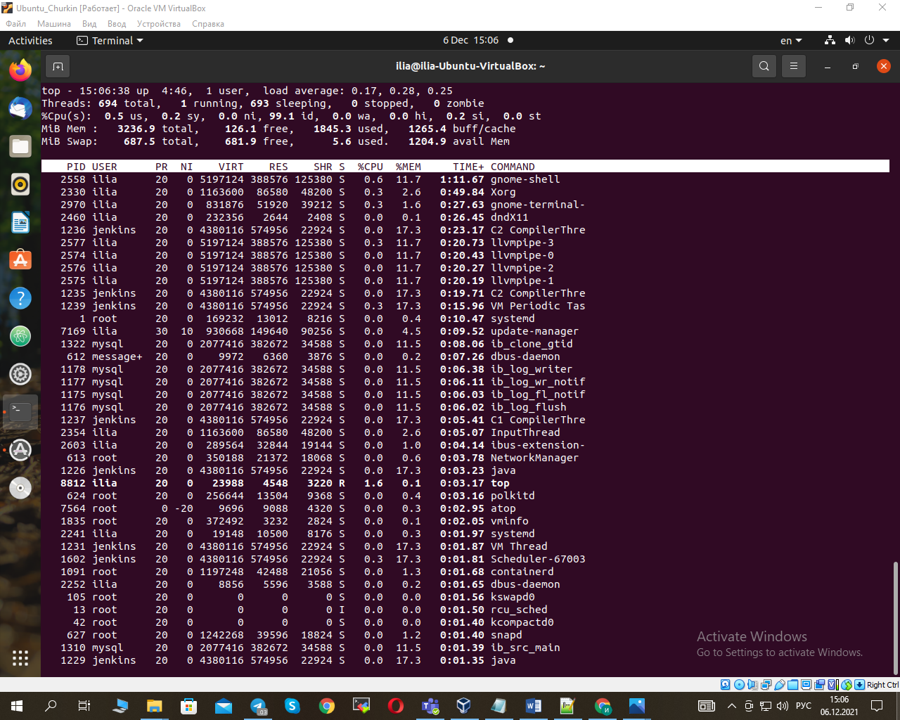
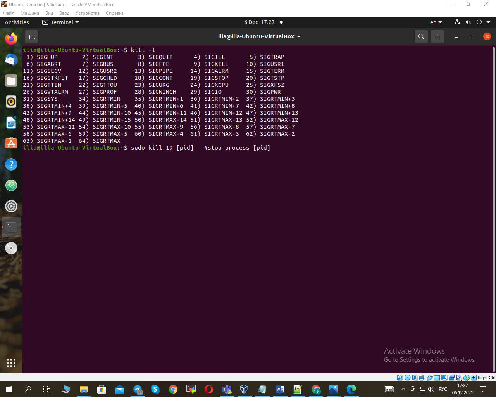

1. Processes in linux from birth to death are in ready, running, waiting states.
   Current process output with "pstree":                    
2. The "proc" file system provides the user with a link to the information of the kernel processes at the moment.
   The processor information:                            
3. The process output with "ps":                         
4. Kernel and other processes:                           
                                                        
                                                        
                                                           														
5. The "S" column describes the state of the process:                                             
   - D - process pending completion;                                                            
   - R - running;                                                                                
   - S - sleeping;                                                                                
   - T - stopped;                                                                                
   - t - stopped by debugger;                                                                   
   - Z - zombie,                                                                                  
   - < - with negative "nice" value. A negative value of "nice" increases the process priority;    
   - N - with positive nice value.  A positive "nice" value decreases the process priority.
   Outputs information about the processes with the "top" utillite:	
                  	                                
                                                        
                                                           																												
6. Displayed the processes for a certain user:             
														 														
7. Displayed the processes for a certain user with "top" utillite:
                                                        
8. Interactive "htop", "atop", "top V n 15":		
                                                        
														
9. Sort "top" by time "Shift+T", by memory "Shift+M":   
																												
10. Changed process priority:                           
                                                        
																												
11. Used the "kill" command:                            
                                                        
														
																												
12. Manage background processes:
    - jobs - displays a list of processes;
    - bg - continues executing the process in the background;
    - fg - takes the process out of the background mode;
    - nohup - allows the process to continue running in the background when it logs out of the system.                                                    
	                                                    
														
																												
13. Checked the implementability of the most frequently used OPENSSH commands in the MS Windows OS:                                               
                                                        
                                                        
														
																														
14. Implement basic SSH settings to increase the security of the client-server connection:
                                                        
                                                        
														
																													
15. Implemented three keys for encryption in SSH (rsa, dsa, ecdsa):
                                                        
														
															
16. Implemented port forwarding for the SSH client from the host machine to the guest Linux VM behind NAT:
                                                        														
17. Intercepted traffic with wireshark while authorizing the remote client:  
                                                        
                                                        
                                                        
														
                                                        
