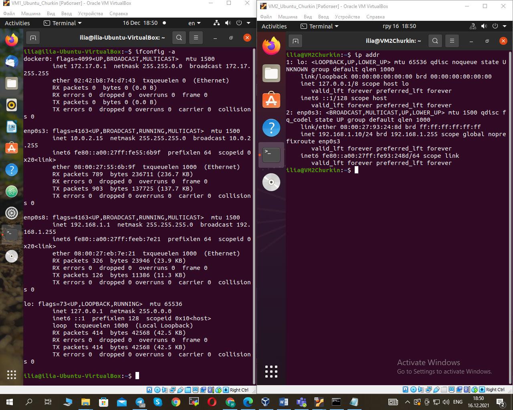
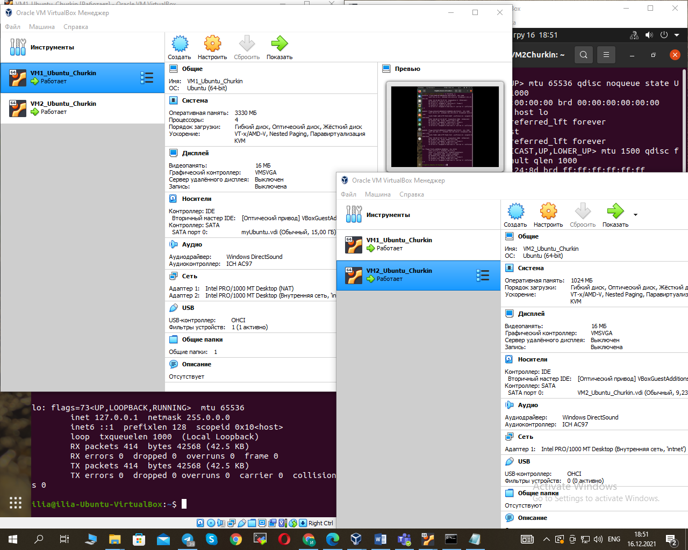
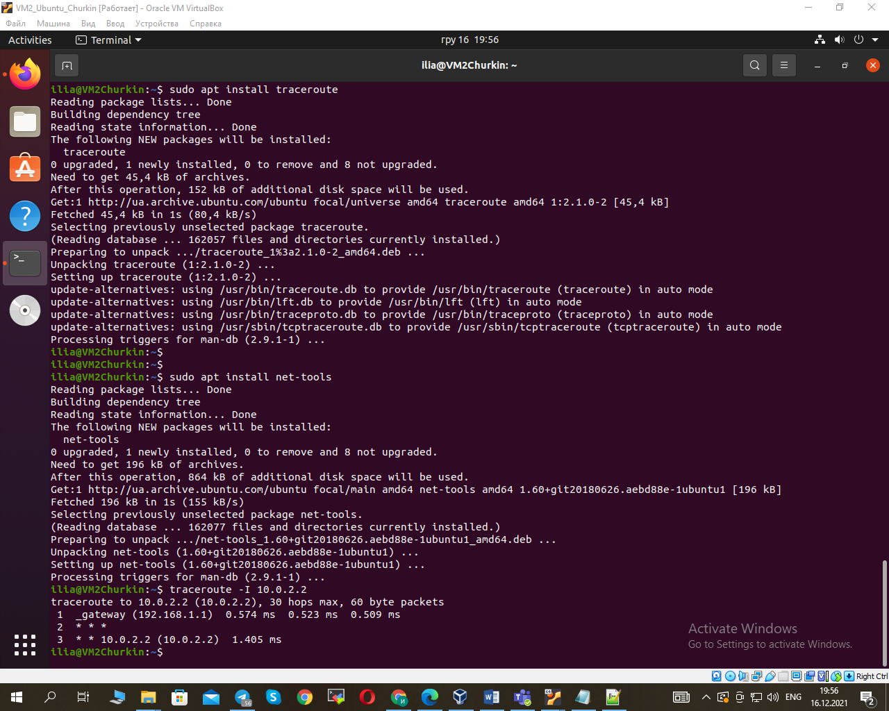
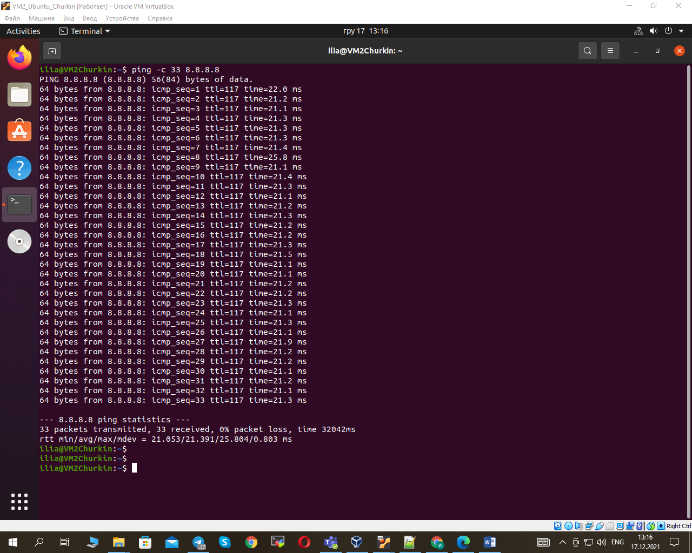
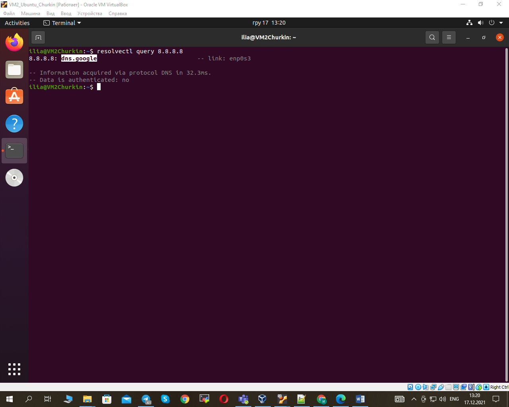
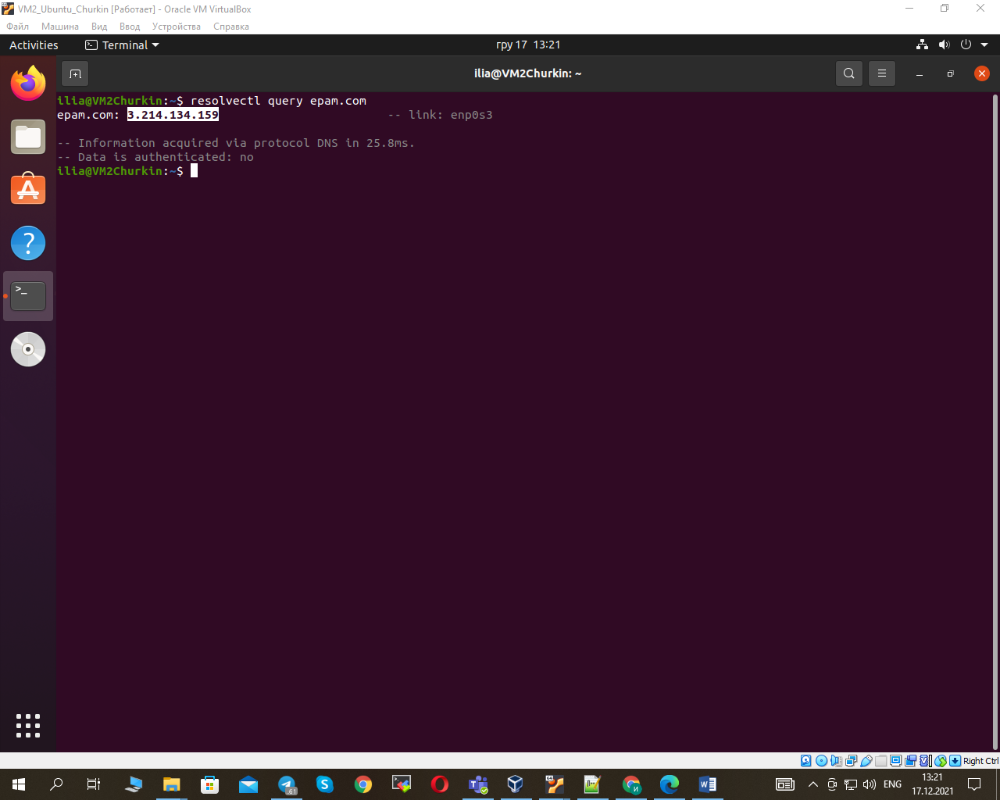
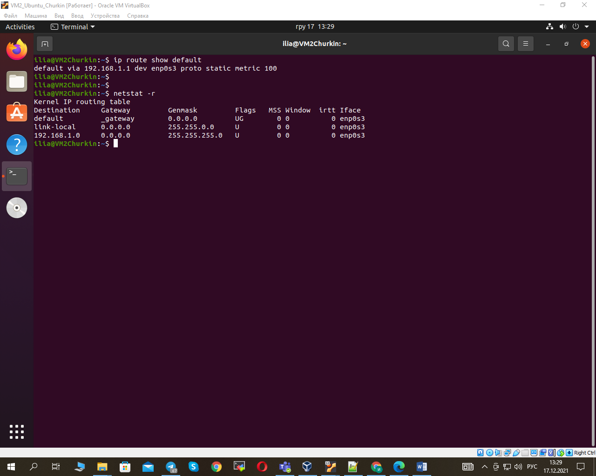
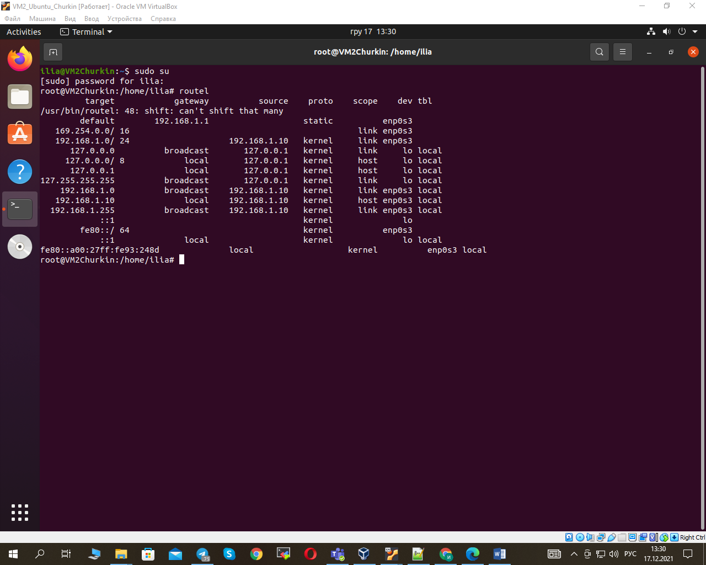
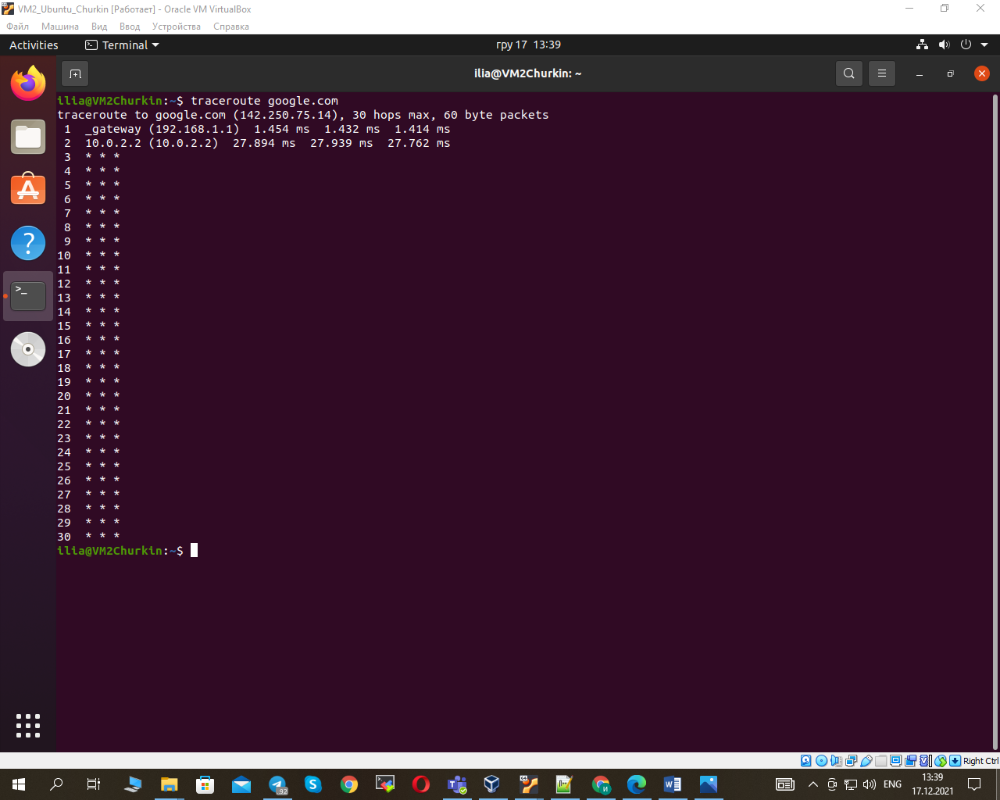

1. Created virtual machines connection according to INET---HOST---nat---VM1---internal---VM2:
                                                          
                                                           
2. Checked the route from VM2 to Host:                   
3. Checked the access to the Internet:                   
4. A resource which has an IP address 8.8.8.8 has been determined:
                                                          
5. The IP address belongs to resource epam.com has been determined:
                                                          
6. The default gateway for your HOST and display routing table has been determined:
                                                          
                                                           
7. The route to google.com has been traced:             
   
   
