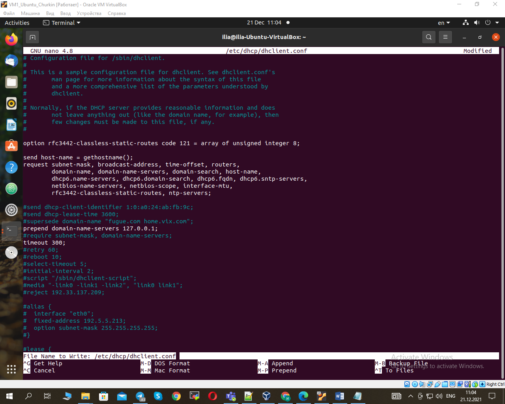
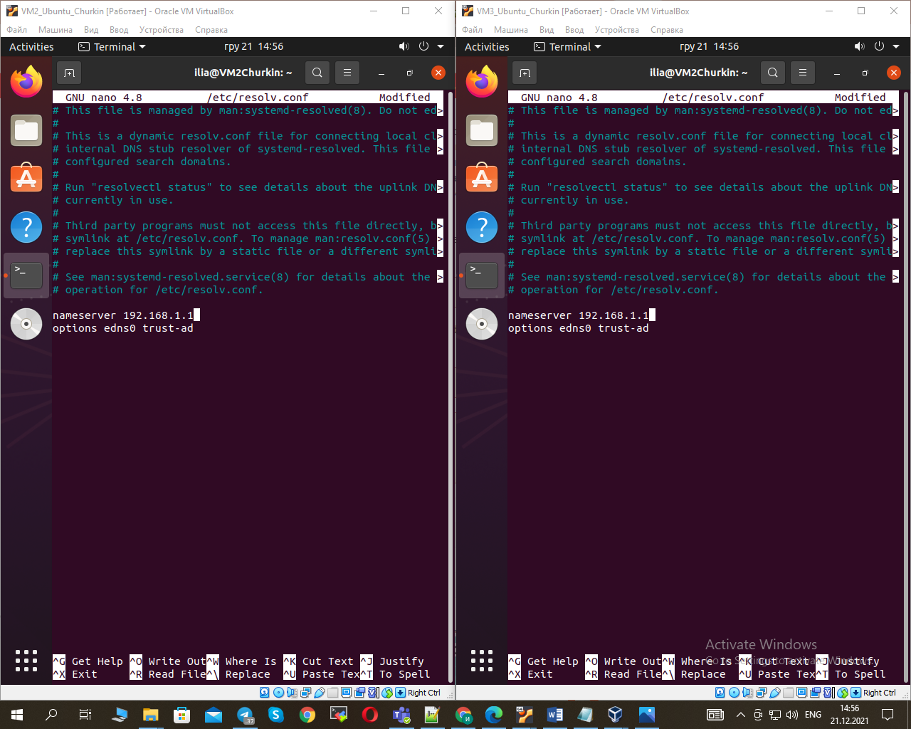

1. Created virtual machines connection according to INET---HOST---nat---VM1---internal---VM2
                                                                           ---internal---VM3:
                                                                                                                     
2. Installed and configured DHCP server on VM1:          
                                                         
                                                         
                                                         
                                                         
3. Checked VM2 and VM3 for obtaining network addresses from DHCP server:														 
														  
4. Installed and configured DNS server on VM1:            
                                                          
                                                          
                                                          
                                                          
                                                          
5. Checked VM2 and VM3 for gaining access to DNS server:  
