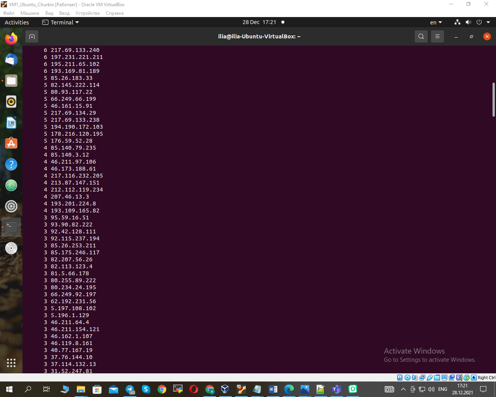

1. When starting without parameters, it display a list of possible keys and their description. 
   The --all key displays the IP addresses and symbolic names of all hosts in the current subnet: 
                                                
2. The --target key displays a list of open system TCP ports.
                                                
                                                														 
3. A script to answer the following questions was created:
   1) From which ip were the most requests? 
   2) What is the most requested page? 
   3) How many requests were there from each ip? 
                                                	
                                                	
													
													
													
													
													
													
													
													
   4) What non-existent pages were clients referred to? 
   5) What time did site get the most requests? 
													
   6) What search bots have accessed the site? (UA + IP)
													
													
													
4. A data backup script that takes the following data as parameters path to the syncing directory 
   and the path to the directory where the copies of the files will be stored was created:
                                                	
													
													
5. The command to run the script was added to crontab with a run frequency of one minute:                                      
                                                	
												
